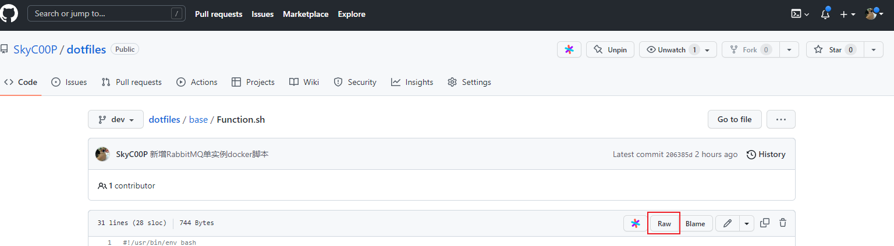

收集汇总各种常见组件的一键式脚本，包括安装，卸载，更新，省略重复繁琐的操作。

当项目发布在代码托管网站，并且能直接访问到文件的raw路径，服务器联网并且有类似curl这种命令行工具，则可远程执行对应的脚本。

假如项目发布在GitHub上，在已经联网的CentOS服务器上执行以下命令便可以在线安装docker.

```
sh -c "$(curl -fsSL https://raw.githubusercontent.com/SkyC00P/dotfiles/dev/component/docker/online_install.sh)"
```

本质上就是把Github上面的脚本下载下来执行。

如脚本执行有问题，可将脚本重定向到文件再加 `set -x` 进行调试

```shell
curl -fsSL https://raw.githubusercontent.com/SkyC00P/dotfiles/dev/component/docker/online_install.sh > install.sh

sh -x install.sh
```

**GitHub RAW URL 路径**

URL格式：`https://raw.githubusercontent.com/${Github_user}/${Github_project}/${Github_branch}/${File_path}`

- Github_user = 用户
- Github_project = 项目名
- Github_branch = 对应的Git分支
- File_path = 脚本路径

示例:`https://raw.githubusercontent.com/SkyC00P/dotfiles/dev/component/docker/online_install.sh`

也可以按下图直接查看文件的 raw url 地址



**GitLab RAW URL 路径**

URL格式: `http://${GitLab_url}/${GitLab_user}/${GitLab_project}/raw/${GitLab_branch}/${File_path}`

- GitLab_url = IP和端口
- GitLab_user = 用户或组名
- GitLab_project = 项目名
- GitLab_branch = 对应的Git分支
- File_path = 脚本路径

示例:`http://192.168.0.55/huzl/kitop-project/raw/master/pom.xml`

也可以按下图直接查看文件的 raw url 地址


## 核心命令

`sh -c "$(curl -fsSL http://192.168.0.55/devops/centos7-runtime-env/raw/master/single/gitclone.sh)"`